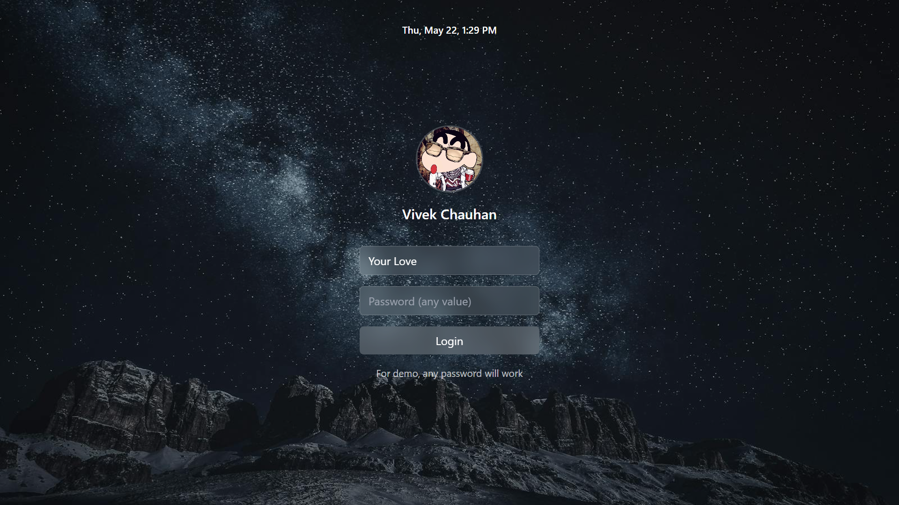
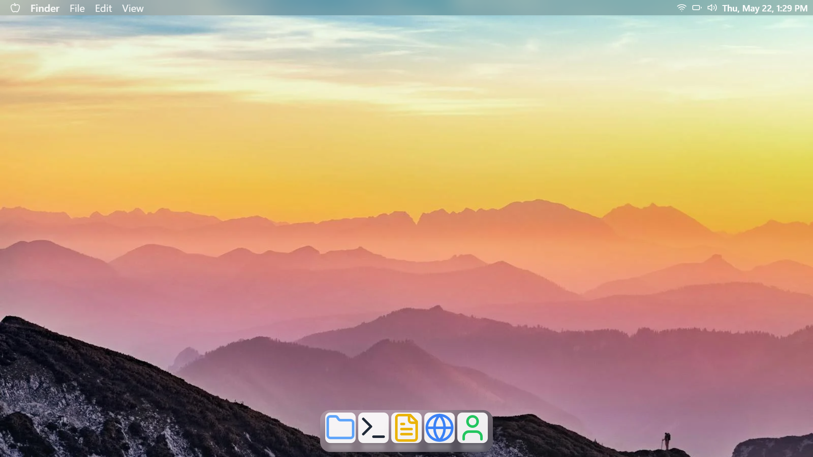

# Vivek's MAC

<h1 align="center">
  <br>
  <a href="https://vivekmac.vercel.app/" target="_blank" rel="noopener noreferrer">
    
  </a>
</h1>

<p align="center"> 
    
    
    
</p>

## 🚀 Features

### Modern UI/UX
- Smooth animations using Framer Motion
- macOS-style design
- Beautiful transitions and hover effects
- Clean and intuitive interface

### Technical Features
- Built with React and TypeScript
- Uses Framer Motion for animations
- Implements custom MAC management system
- Modern state management

## ��️ Technologies Used

- React
- TypeScript
- Framer Motion
- Tailwind CSS
- Vercel (Deployment)


1. Clone the repository
```bash
git clone https://github.com/yourusername/vivek-s-mac.git
```

2. Install dependencies
```bash
cd vivek-s-mac
npm install
```

3. Start the development server
```bash
npm run dev
```

### Visual Design
- MACOS-inspired RealMACOS design
- Smooth animations for all interactions
- Visual feedback for active/inactive states
- Modern shadow effects
- Clean and minimal interface


## 🚀 Deployment
The application is deployed on Vercel and can be accessed at [vivekmac.vercel.app](https://vivekmac.vercel.app/)

## 🤝 Contributing
Contributions are welcome! Please feel free to submit a Pull Request.

## 📝 License
This project is licensed under the MIT License - see the LICENSE file for details.

## 👨‍💻 Author
Vivek

## 🙏 Acknowledgments
- Inspired by macOS design
- Built with modern web technologies
- Thanks to all contributors and supporters
